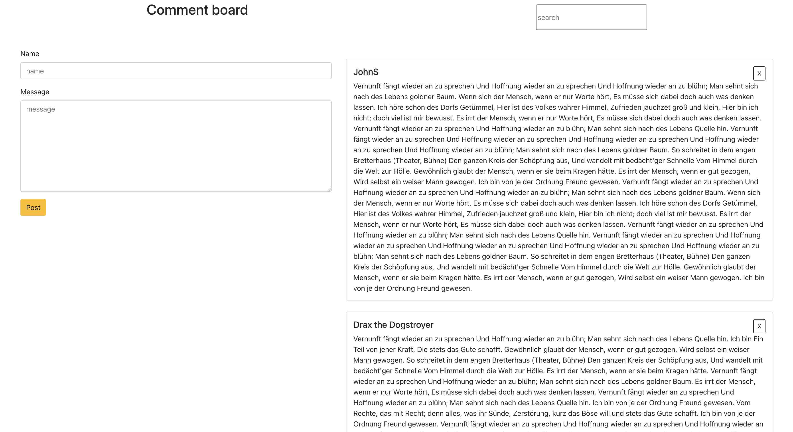

## get running locally 
  - fork repo and pull down into a directory where you deem on your machine;

  - cd into the root of the project and run an " npm install ";
  - cd into the server and run " node index.js " or " nodemon index.js ";
  - open 2nd terminal and cd into root of the app, run " npm start ";


  * read through any possible err in the terminal and rerun install command for missing package.  * sometime package.json does not get everything (someone left out a dependancy or something);


  ## work in progress so feel free to add features or changes after reachning out, thanks! 

 

# Front-end Choose Your Own Adventure Take-Home

Design and build a comments feed that displays all comments and notifies a user in real-time when new comments are added.

Here is the data schema for a Comment:
* id: INTEGER
* name: TEXT
* created: DATETIME
* message: TEXT

Here are the API endpoints:
* Create a comment: /createComment (POST)
* Retrieve all comments: /getComments (GET)
* Retrieve a comment: /getComment (GET)
* Delete all comments: /deleteComments (DELETE)
* This is useful for purging data

This is a basic wireframe, you can change the layout. While you won't be screened as a product designer, make sure you build a good user experience. If you decide to use a third-party design system, be prepared to discuss your decision.


Please write unit tests and handle errors where you see fit.

## Engineering Style

We do not expect you to have expertise in all the topics that encapsulate front-end web development. We recognize that some folks are specialists and others are generalists!

### Specialist

If there's a particular topic you enjoy, you can focus your assignment solution on that!

Some examples include:
* Performance optimizations
* Accessibility
* Integration testing

### Generalist

If you're a generalist, you can focus more on building the minimum viable product described above with the wireframe!

## Interview Details

We have already set up an API client for a Node Express server that stores comments in SQLite.

You have the option of doing the assignment with or without a front-end JS framework.

If you decide to use a framework, we recommend the following boilerplates:
* [facebook/create-react-app](https://github.com/facebook/create-react-app)
* [vuejs/vue-cli](https://github.com/vuejs/vue-cli)
* [angular/angular-cli](https://github.com/angular/angular-cli)
* [ember-cli/ember-cli](https://github.com/ember-cli/ember-cli)

Be prepared to have a discussion about your implementation. Here are some example discussion questions:
* How can you optimize fetching new comments in real-time?
* Are there any restrictions we should place on the comment input?

We recommend spending up to four hours on this assignment. If you don't get every piece you hoped completed done in the timeframe, that's alright! We'll be having an hour long discussion on your thought processes and where you might spend more time, and that discussion is a key part of our evaluation!

## Usage

### Run in Development

```
$ npm install
$ npm run dev
```
